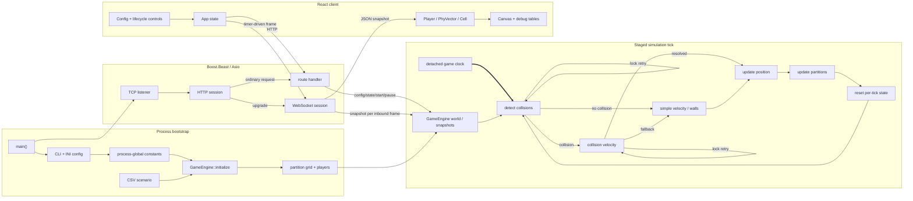

<!-- canonical: project_orientation -- repository-wide architecture and maturity map -->

# Blob Royale: Project Deep Dive

Reviewed on 2026-08-04 at commit `049f4a4` (`main`, matching `origin/main`). This document describes the repository as it exists at that commit. It distinguishes reachable, verified behavior from intended behavior that is currently blocked by build failures.

## Executive assessment

Blob Royale is a compact, technically ambitious systems prototype: a C++20 simulation engine, a custom dependency-aware worker pipeline, a Boost.Beast HTTP/WebSocket server, and a React canvas/debug client form a recognizable end-to-end design.

It is not currently a runnable game or a production-ready service. The checked-in C++ interfaces contain compile-time contradictions, the React production build fails, the only frontend test suite executes zero tests, and the files named as backend tests are scenario fixtures without assertions. Beneath those build blockers, the scheduler, shared-state model, spatial index, and collision implementation contain correctness and concurrency defects that make runtime results untrustworthy.

The fairest label is **promising architecture prototype, interrupted during benchmark work**. The last five commits all concern an incomplete benchmark path, and the current head preserves several regressions introduced in that work.

| Dimension | Assessment | Why |
|---|---|---|
| Architectural intent | Strong for a prototype | Clear engine/server/client boundaries and an explicit staged simulation pipeline |
| Current buildability | Broken | Source-proven C++ signature conflicts; reproduced React build failure |
| Correctness confidence | Low | No assertion-based engine tests; known scheduler, partition, timing, and collision defects |
| Product completeness | Early prototype | No applied player input, game rules, persistence, sessions, matchmaking, or finished benchmark |
| Security posture | Development-only | Global lifecycle is exposed to unauthenticated network callers; shared state races with requests |
| Operability | Low | Machine-specific addresses/paths, stale docs, no CI, health check, deployment recipe, or structured telemetry |

## Repository at a glance

- 76 tracked files and 57 commits, all authored between 2025-05-04 and 2025-06-12.
- Approximately 3,734 lines of first-party C++ across 35 `.cpp`, `.hpp`, and `.tpp` files.
- Approximately 521 lines of React JavaScript/CSS across 15 source files.
- One executable target, four internal C++ library targets, one React application, three CSV scenarios, and one unfinished benchmark entry point.
- No tags, releases, CI configuration, deployment manifests, CTest registration, C++ test framework, or repository license file.

## What is here

| Area | What it owns | Principal files |
|---|---|---|
| Process bootstrap | Logging, CLI/config loading, global constants, engine initialization, server lifetime | [`main.cpp`](../main.cpp), [`CMakeLists.txt`](../CMakeLists.txt) |
| Boost integration | Beast/Asio aliases, JSON, logging, and program-options wrappers | [`src/boost-headers`](../src/boost-headers) |
| Queue scheduler | Cyclic start/finish dependencies and per-stage worker queues | [`src/dependency_graph_queue`](../src/dependency_graph_queue) |
| Game engine | Entities, vectors, collision physics, spatial partitions, ticks, snapshots | [`src/game_engine`](../src/game_engine) |
| Network server | TCP listener, HTTP sessions/router, WebSocket sessions | [`src/server`](../src/server) |
| Browser client | Connection controls, state projection, canvas drawing, debug tables, benchmark route | [`frontend-react/src`](../frontend-react/src) |
| Scenario data | CSV initial states for a partition trace, wall collisions, and player collisions | [`tests`](../tests) |
| Benchmark scaffold | A second C++ entry point and an unfinished React page | [`benchmark-test.cpp`](../benchmark-test.cpp), [`Benchmark.js`](../frontend-react/src/Benchmark.js) |
| Vendored code | RapidCSV 8.87 single-header CSV parser | [`rapidcsv.h`](../open-source-libs/rapidcsv/rapidcsv.h#L1) |
| Local setup | Interactive shell variables and aliases | [`run-blob-royale-dev-env-setup`](../scripts/run-blob-royale-dev-env-setup) |

### Build and dependency surfaces

The native build asks for CMake 3.15+, C++20, Threads, and system-installed Boost components `log`, `log_setup`, `program_options`, and `json` ([root CMake](../CMakeLists.txt#L2), [Boost CMake](../src/boost-headers/CMakeLists.txt#L5)). Boost is neither version-pinned nor bootstrapped. RapidCSV is pinned by vendoring its version 8.87 header, although the BSD license file referenced by that header is absent ([rapidcsv.h:2](../open-source-libs/rapidcsv/rapidcsv.h#L2)).

The browser application uses React 19, React Router 7, Axios 1.9, and Create React App/react-scripts 5, with a lockfile v3 ([package.json:5](../frontend-react/package.json#L5), [package-lock.json:1](../frontend-react/package-lock.json#L1)). The package does not declare supported Node/npm versions or a package-manager version. Build and test tooling is listed under production `dependencies`, so npm classifies nearly the full 1,349-package tree as production dependencies.

The native libraries use `file(GLOB ...)` without `CONFIGURE_DEPENDS`, so newly added source files require an explicit CMake reconfigure ([game engine CMake:3](../src/game_engine/CMakeLists.txt#L3)).

## Intended runtime architecture



This is the intended/as-coded flow. The current C++ and React build blockers prevent it from being a verified reachable runtime at this commit.

## Native process and configuration

`main()` initializes logging, parses command-line and INI configuration, derives global engine constants, loads a CSV scenario into the singleton `GameEngine`, and starts a two-thread Asio server ([main.cpp:64](../main.cpp#L64)). SIGINT and SIGTERM stop the I/O context, after which the I/O threads are joined ([main.cpp:30](../main.cpp#L30)). This coordination covers only the I/O threads: engine workers and clocks are detached, and the normal post-signal path incorrectly returns `EXIT_FAILURE` ([main.cpp:97](../main.cpp#L97)).

Recognized command-line options are:

| Option | Default | Purpose |
|---|---|---|
| `--IPv4` | `192.168.86.12` | Bind address |
| `--IPv6` | none | Parsed but not consumed by `main()` |
| `--port` | `8000` | Listen port |
| `--config` | `../config/blob-royale.cfg` | Engine INI file |
| `--testfile` | `../test/player-on-wall-collision-test` | CSV scenario; the default path is wrong because the tracked directory is `tests/` |

Evidence: [`boost-program-options.cpp:9`](../src/boost-headers/boost-program-options.cpp#L9).

The tracked sample configuration specifies a 960×640 map, 400 nominal ticks per second, radius 10, a 16×16 partition grid, and `WORKER_COUNT=2` ([blob-royale.cfg](../config/blob-royale.cfg)). Constants are stored as process-global mutable variables ([game_engine_parameters.cpp:7](../src/game_engine/game_engine_parameters.cpp#L7)). `WORKER_COUNT` is parsed and stored but ignored: all six queue stages are constructed with exactly one worker ([game_engine.cpp:209](../src/game_engine/game_engine.cpp#L209)).

## Game engine

### World and entities

`GameEngine::initialize()` creates every partition, reads the CSV with RapidCSV, accepts only rows whose first field is `player`, constructs `Player` objects, and seeds the queue graph ([game_engine.cpp:79](../src/game_engine/game_engine.cpp#L79)). The active entity hierarchy is `Player -> GamePiece`. A player only adds a JSON type envelope and reports that it is non-stationary ([player.cpp:25](../src/game_engine/player.cpp#L25)).

`MapObject` is an unused stub. Its partition update is empty and its `is_stationary()` implementation returns false ([map_object.cpp:15](../src/game_engine/map_object.cpp#L15)). There are no game rules for growth, consumption, scoring, death, rounds, or victory.

Each serialized player exposes:

```json
{
  "type": "player",
  "gamepiece": {
    "id": 0,
    "pos": [250.0, 80.0],
    "vel": [0.0, 2.5],
    "acc": [0.0, 0.0],
    "main_part": [2, 4],
    "parts": [[1, 3], [1, 4]]
  }
}
```

The schema is assembled in [`game_piece.cpp:314`](../src/game_engine/game_piece.cpp#L314) and wrapped in [`player.cpp:25`](../src/game_engine/player.cpp#L25).

### Tick pipeline

The scheduler routes every player through six stages:

| Stage | Responsibility | Routes to |
|---|---|---|
| Detect collision | Search partitions, deduplicate pairs, choose nearest collision | Collision velocity, simple velocity, or itself for lock retry |
| Collision velocity | Apply pairwise elastic-collision equations | Position, simple velocity, or itself for lock retry |
| Simple velocity | Reflect at walls; acceleration is currently ignored | Position |
| Position | Add velocity directly to position | Partition update |
| Partition update | Recalculate current and neighboring cells | Finished |
| Finished | Clear per-tick collision bookkeeping | Detect collision for the next tick |

Routing is wired in [`game_engine.cpp:127`](../src/game_engine/game_engine.cpp#L127); operations live in [`game_piece.cpp:389`](../src/game_engine/game_piece.cpp#L389).

The dependency graph adds start and finish barriers around those queues. A queue worker waits until the service is running, start dependencies are satisfied, and its queue is non-empty; it performs one operation, forwards the player according to the result, and recursively calls itself for the next unit of work ([dependency_graph_queue.tpp:141](../src/dependency_graph_queue/dependency_graph_queue.tpp#L141)).

| Stage | Start waits on | Finish waits on |
|---|---|---|
| Detect | Previous finished stage plus external clock pulse | Finished |
| Collision velocity | Detect | Detect |
| Simple velocity | Previous finished stage | Detect and collision velocity |
| Position | Detect | Simple velocity |
| Partition | Detect | Position |
| Finished | Partition | Partition |

The exact relationships are declared in [`game_engine.cpp:131`](../src/game_engine/game_engine.cpp#L131).

### Time model

The engine converts ticks per second to an integer millisecond period, sleeps a detached clock thread to each deadline, and submits an external start notification to the detect queue ([game_engine_parameters.cpp:45](../src/game_engine/game_engine_parameters.cpp#L45), [game_engine.cpp:252](../src/game_engine/game_engine.cpp#L252)). Position integration is `position += velocity`; it does not scale by elapsed time, and acceleration is not applied ([game_piece.cpp:436](../src/game_engine/game_piece.cpp#L436), [game_piece.cpp:488](../src/game_engine/game_piece.cpp#L488)).

At the configured 400 Hz, `2.5 ms` is truncated to `2 ms`, so the target becomes 500 Hz. Rates over 1,000 Hz become a zero-millisecond busy schedule.

## HTTP and WebSocket server

The server is adapted from Boost.Beast's advanced server example. The listener opens/binds/listens, accepts each socket onto an Asio strand, and creates an `http_session` ([my_listener.cpp:27](../src/server/my_listener.cpp#L27), [my_listener.cpp:85](../src/server/my_listener.cpp#L85)). Useful defensive scaffolding already exists:

- 10,000-byte HTTP body limit.
- 30-second HTTP read timeout.
- At most eight queued pipelined responses per HTTP session.
- A strand per accepted connection.
- Beast's suggested server timeout policy for WebSockets.

Evidence: [`my_http_server.cpp:55`](../src/server/my_http_server.cpp#L55), [`my_http_server.hpp:14`](../src/server/my_http_server.hpp#L14), [`my_websocket.hpp:38`](../src/server/my_websocket.hpp#L38).

### Active HTTP surface

| Target | Behavior | Side effect |
|---|---|---|
| `/game-config` | Return map/tick/partition constants as JSON | None |
| `/game-state` | Serialize all current players | None, but races with simulation mutation |
| `/start-sim` | Mark all queues running and detach a new clock thread | Starts global simulation; not idempotent |
| `/pause-sim` | Clear running flags | Pauses global simulation |
| Anything else | Return 404 | None |

The router is [`helpers.hpp:117`](../src/server/helpers.hpp#L117). Its HTTP-method validation is commented out, so these targets respond based only on the path. Responses enable `Access-Control-Allow-Origin: *` on the active API routes. There is no authentication, authorization, caller identity, CSRF/origin policy, request ID, or rate limit.

Every WebSocket upgrade is accepted without checking its target or `Origin`. A session repeatedly reads one frame, ignores its contents, serializes the complete game state, writes that snapshot, and reads again ([my_websocket.cpp:51](../src/server/my_websocket.cpp#L51)). This is request/response polling over WebSocket, not server push. Application-level player input is not implemented.

## React client

The intended UI is a manual debug harness rather than a game interface:

1. The user clicks **get config**, which fetches `/game-config` and converts it to a `Map` ([Config.js:7](../frontend-react/src/Config.js#L7)).
2. The user clicks **connect to server**, which opens a WebSocket ([App.js:66](../frontend-react/src/App.js#L66)).
3. The user clicks **start**, which calls `/start-sim` and starts a browser interval ([App.js:81](../frontend-react/src/App.js#L81)).
4. Every interval sends `{ "acc": [0.7, 1.1] }`. The server ignores it and returns a snapshot ([App.js:40](../frontend-react/src/App.js#L40), [my_websocket.cpp:78](../src/server/my_websocket.cpp#L78)).
5. The client replaces its `players` state with model objects, redraws the canvas, and renders configuration/player debug tables ([App.js:48](../frontend-react/src/App.js#L48), [GameCanvas.js:9](../frontend-react/src/GameCanvas.js#L9), [DebugPanel.js:31](../frontend-react/src/DebugPanel.js#L31)).

HTTP and WebSocket URLs are hardcoded to `192.168.86.12:8000` over plaintext ([App.js:24](../frontend-react/src/App.js#L24)). The client has no schema validation, parse error boundary, Axios timeout/rejection handling, WebSocket close/error handling, or send-side backpressure check. Pausing closes the socket but leaves `connected=true`; resuming starts a timer that sends on the closed socket ([App.js:27](../frontend-react/src/App.js#L27)).

The `/benchmark` React route is intended to call a backend benchmark endpoint. It is not usable: the root imports a nonexistent filename, the component has invalid syntax and no Axios import, and the backend has no `/benchmark` route ([index.js:5](../frontend-react/src/index.js#L5), [Benchmark.js:7](../frontend-react/src/Benchmark.js#L7), [helpers.hpp:119](../src/server/helpers.hpp#L119)).

## Tests, fixtures, and benchmark status

The three files in `tests/` are useful, focused initial-state fixtures, but none is an executable test. They contain no expected state or assertions. There is no `enable_testing()`, `add_test()`, C++ test target/framework, coverage setup, sanitizer setup, or CI workflow.

The one React test is the unchanged Create React App assertion that looks for “learn react,” content the current application does not render ([App.test.js:4](../frontend-react/src/App.test.js#L4)).

The native `benchmark-test.cpp` is not registered in CMake, includes the nonexistent `game-engine.hpp`, declares `main()` without `argc/argv` but uses both, and returns `EXIT_FAILURE` on its nominal path ([benchmark-test.cpp](../benchmark-test.cpp)). `GameEngine::run_benchmark()` records an unused start time, starts a clock, and reports no result ([game_engine.cpp:270](../src/game_engine/game_engine.cpp#L270)).

## Reproduced verification results

Environment: Apple Clang 21.0.0, Node 25.9.0, npm 11.12.1.

| Command/check | Result | Interpretation |
|---|---|---|
| `npm ci` | Passed; installed 1,349 packages | The lockfile is internally reproducible in this environment |
| `npm run build` | Failed: cannot resolve `./Benchmark-Test.js` | Browser production artifact cannot be built at current head |
| `CI=true npm test -- --watchAll=false --runInBand` | Failed before execution; 0 tests ran because Jest 27 could not parse Axios 1.9's ESM entry | There is no green frontend test signal |
| `npm exec -- eslint src` | Failed with one syntax error in `Benchmark.js` and 12 warnings | Static checks are not green |
| `npm audit --omit=dev --json` | 59 findings: 3 critical, 30 high, 13 moderate, 13 low | The CRA-era dependency tree needs triage; many findings are transitive build tooling, while Axios is directly affected |
| `cmake --version` | Could not run: CMake is absent on this machine | A full native build was not verified here |
| Native source consistency | Failed by inspection: two public declarations contradict definitions/call sites | The native target cannot compile as written, independent of local CMake availability |

The native blockers are:

- `CycleDependency::register_external_start_dependency()` is declared `void`, defined as returning `int`, and assigned to an `int` ([cycle_dependency.hpp:23](../src/dependency_graph_queue/cycle_dependency.hpp#L23), [cycle_dependency.cpp:70](../src/dependency_graph_queue/cycle_dependency.cpp#L70), [game_engine.cpp:153](../src/game_engine/game_engine.cpp#L153)).
- `GameEngine::run_game_clock()` is declared with no parameter, defined with an `int`, invoked once with no argument, and invoked once with a floating argument ([game_engine.hpp:69](../src/game_engine/game_engine.hpp#L69), [game_engine.cpp:248](../src/game_engine/game_engine.cpp#L248), [game_engine.cpp:252](../src/game_engine/game_engine.cpp#L252), [game_engine.cpp:284](../src/game_engine/game_engine.cpp#L284)).

## Biggest strengths

### 1. The end-to-end concept is unusually complete for its size

The repository contains every conceptual leg of a multiplayer simulation loop: scenario ingestion, domain entities, spatial indexing, collision response, tick coordination, state serialization, HTTP lifecycle control, WebSocket transport, browser-side models, canvas rendering, and debugging views. Even though the current head is broken, the intended data journey is easy to trace.

### 2. The simulation pipeline is explicit and extensible

Routing outcomes such as `send_back`, `option1`, and `option2` through named stage queues makes the intended parallelism visible. Start and finish dependencies try to express more than a simple job queue: they model phase barriers and backpressure from the game clock. This is the project's most original piece of engineering.

### 3. Domain separation is directionally good

Engine, scheduler, network server, and Boost integration are separate CMake targets. React-side rendering models are also separated from the application controller. This is a healthier base than a monolithic proof of concept and gives future repair work natural seams.

### 4. Spatial partitioning is the right scaling instinct

The engine does not blindly compare every player with every other player. It models a grid, registers players in nearby cells, and limits collision candidates to relevant partitions. The current ordering implementation is wrong, but the architectural choice is appropriate for a larger arena simulation.

### 5. The transport scaffold includes real defensive details

Per-connection strands, body/time/queue bounds, coordinated I/O shutdown, and Boost.JSON serialization show awareness of production failure modes. The shutdown is incomplete—detached engine threads are not joined and the process reports failure—but these controls are still good building blocks.

### 6. The project contains useful debugging surfaces

Thread-named logs, a configuration endpoint, a player/partition debug table, canvas cell rendering, and focused CSV scenarios make the invisible parts of the simulation observable. Those fixtures are strong seeds for future regression tests.

## Biggest weaknesses

### 1. There is no trustworthy working baseline

Both application entry paths are broken, no automated gate exists, and the test-shaped assets do not validate behavior. This dominates every other weakness: until `main` builds and CI proves a minimal simulation, architectural progress cannot be distinguished from regression.

The repository history reinforces this diagnosis. The latest work is explicitly labeled incomplete benchmark infrastructure, and current benchmark files are disconnected or syntactically invalid.

### 2. Concurrency complexity arrived before correctness was secured

The queue system has multiple concrete invariant failures:

- Notification maps are passed by value, so “seen” flags never persist; duplicates can corrupt exact-equality counters ([cycle_dependency.hpp:101](../src/dependency_graph_queue/cycle_dependency.hpp#L101)).
- `external_notifications` is never reset, so the external tick gate becomes permanently satisfied after the first pulse ([cycle_dependency.cpp:237](../src/dependency_graph_queue/cycle_dependency.cpp#L237)).
- Waiters block until `can_start` becomes false, but `reset_cycle()` never notifies their condition variable ([cycle_dependency.cpp:92](../src/dependency_graph_queue/cycle_dependency.cpp#L92), [cycle_dependency.cpp:237](../src/dependency_graph_queue/cycle_dependency.cpp#L237)).
- Worker predicates combine state mutated under different mutexes, including plain non-atomic booleans ([dependency_graph_queue.tpp:116](../src/dependency_graph_queue/dependency_graph_queue.tpp#L116), [cycle_dependency.hpp:34](../src/dependency_graph_queue/cycle_dependency.hpp#L34)).
- Workers recurse forever rather than using a stop-aware loop, and all worker/clock threads are detached raw pointers ([dependency_graph_queue.tpp:64](../src/dependency_graph_queue/dependency_graph_queue.tpp#L64), [dependency_graph_queue.tpp:149](../src/dependency_graph_queue/dependency_graph_queue.tpp#L149)).
- Partition writers lock `pieces`, but `get_pieces()` returns its container by reference without locking; collision detection then copies it unsafely. With the phase barriers already broken, partition updates and collision reads can overlap ([partition.cpp:85](../src/game_engine/partition.cpp#L85), [partition.cpp:104](../src/game_engine/partition.cpp#L104), [game_piece.cpp:394](../src/game_engine/game_piece.cpp#L394)).

Separately, HTTP threads serialize state while physics workers mutate it, and `running` is shared unsafely between request and clock threads. In C++, these data races are undefined behavior, not merely stale reads ([game_engine.cpp:237](../src/game_engine/game_engine.cpp#L237), [game_engine.cpp:302](../src/game_engine/game_engine.cpp#L302)).

### 3. Core simulation math and spatial indexing are not reliable

- `nearest_collision_distance` is uninitialized during the first cycle ([game_piece.hpp:75](../src/game_engine/game_piece.hpp#L75), [game_piece.cpp:419](../src/game_engine/game_piece.cpp#L419)).
- `Cell::operator<` compares the row twice and never compares the column, so the manual partition-merge comparison cannot order same-row/different-column cells ([partition.cpp:64](../src/game_engine/partition.cpp#L64)).
- The partition merge algorithm stores `shared_ptr<Partition>` using pointer ownership order but compares dereferenced cell values as though both sets used that value order ([game_piece.hpp:66](../src/game_engine/game_piece.hpp#L66), [game_piece.cpp:279](../src/game_engine/game_piece.cpp#L279)).
- Equal-distance collisions overwrite one another because distance is the unique map key ([game_piece.cpp:416](../src/game_engine/game_piece.cpp#L416)).
- The “moving apart” guard compares both velocities in the center-of-mass frame. For positive masses those vectors are anti-parallel, so their dot product cannot become positive and the branch does not reject separating overlaps ([game_piece.cpp:348](../src/game_engine/game_piece.cpp#L348)).
- The second collision body's tangent uses `v1t_after` instead of `v2t_after`, violating the intended equation ([game_piece.cpp:559](../src/game_engine/game_piece.cpp#L559)).
- Acceleration and `delta_time` are ignored; the configured tick frequency is truncated.

With no physics assertions, these defects can produce plausible-looking animation while violating conservation, missing collisions, or indexing the wrong cells.

### 4. The network control plane can damage shared process state

The valuable assets here are not secrets or user records—the repository has none. They are simulation integrity and process availability. Any caller that can reach the server can start or pause the one global simulation. Repeated `/start-sim` calls allocate and detach unbounded clock threads, which makes a straightforward CPU/memory exhaustion path ([helpers.hpp:139](../src/server/helpers.hpp#L139), [game_engine.cpp:237](../src/game_engine/game_engine.cpp#L237)).

Likewise, any WebSocket client can trigger full-state serialization per frame, with no caller, connection, frame-rate, or application message-size policy. This is conditional on network reachability; the repository provides no reverse proxy or deployment configuration that might add controls.

For a strictly local prototype, full user/RBAC machinery would be disproportionate. Appropriate immediate controls are cheaper: bind to loopback by default, make lifecycle transitions idempotent and serialized, use side-effecting methods, enforce the intended WebSocket path/origin, and cap connections/messages. Authentication becomes necessary when the simulation is shared beyond one trusted developer.

### 5. Configuration and input boundaries are unsafe and nonportable

Configuration accepts unrestricted signed integers and performs division/allocation before robust validation. Zero partition counts can divide by zero; negative counts can become enormous unsigned loop bounds ([game_engine_parameters.cpp:32](../src/game_engine/game_engine_parameters.cpp#L32), [game_engine.cpp:83](../src/game_engine/game_engine.cpp#L83)). CSV rows are indexed without checking width or coordinate bounds, and positions become unchecked vector indexes ([game_piece.cpp:103](../src/game_engine/game_piece.cpp#L103), [game_engine.cpp:339](../src/game_engine/game_engine.cpp#L339)).

Operation also depends on one developer's LAN address and Linux home path. The documented command, parser defaults, setup script, and actual paths disagree. This prevents a new machine—or a coding agent—from finding one reliable launch path.

### 6. The protocol and product loop are placeholders

The browser sends acceleration, but the server ignores it. State is delivered only in response to client polling frames. There is no player identity, ownership, authentication, command validation, server-push tick stream, disconnect policy, or game lifecycle. The project demonstrates moving circles, not yet Blob Royale gameplay.

### 7. Documentation, observability, and dependency hygiene lag the design

The root README's command is wrong, the engine README documents a nonexistent `GameState`, and the frontend README is stock CRA content. Files such as `helpers.hpp` and `my_*` obscure canonical responsibilities. Hot-path logs are colorized, unfiltered console text rather than structured events, and the repository has no health/readiness signal or metrics. There is no dependency update strategy, and the current npm audit reports 59 findings.

The repository also omits license texts for both the project and copied/vendored code that explicitly references them.

## Trust-boundary map

| Boundary | Asset at risk | Current validation/control | Consequence |
|---|---|---|---|
| CLI/INI → global constants | Process availability and valid geometry | Types plus late `assert`s | Divide-by-zero, huge allocation, invalid timing |
| CSV → entities/partitions | Simulation integrity and memory safety | Type string and catch-all numeric conversion | Short rows/out-of-map values can crash or index invalid memory |
| HTTP caller → global engine | Availability and lifecycle integrity | Path comparison only | Any reachable caller can start/pause; repeated start spawns threads |
| WebSocket client → server | Availability | Transport timeout only | Any target/origin can trigger repeated full-state serialization |
| Engine workers → network readers | Memory safety and snapshot consistency | No snapshot boundary | Concurrent mutation/read is undefined behavior |
| Server → React client | Browser availability and UI consistency | Unchecked `JSON.parse` and object construction | Malformed/large frames throw or consume resources |

Unknown external controls—TLS termination, firewalling, reverse-proxy authentication, or rate limiting—are not credited because no deployment artifacts document them.

## Recommended recovery order

### Gate 1: Re-establish a buildable main branch

1. Reconcile the two C++ declaration/definition conflicts.
2. Either finish or remove the disconnected benchmark surface from the default build.
3. Fix the React import/syntax issues and align Axios/Jest or replace the obsolete test harness.
4. Add CI that runs a clean native configure/build, React production build, lint, and non-watch tests.
5. Return success after coordinated signal shutdown.

**Exit condition:** a clean checkout has one documented launch/build path and a green CI run covering every build, lint, and test check listed above.

### Gate 2: Establish a deterministic correctness baseline

1. Turn the CSV scenarios and focused engine operations into characterization tests with physically derived expectations for wall reflection, head-on collision, oblique collision, separating overlaps, partition boundaries, equal-distance multi-collision, and out-of-bounds rejection.
2. Initialize every entity field and repair config, partition, timing, and collision invariants against those tests.
3. Replace the scheduler execution path with one canonical, single-threaded, explicit tick loop; do not maintain parallel engine implementations.
4. Add AddressSanitizer and UndefinedBehaviorSanitizer to the test build.

**Exit condition:** deterministic expected snapshots pass repeatedly without the network layer.

### Gate 3: Reintroduce concurrency behind proven boundaries

1. Make lifecycle an idempotent, serialized state machine that owns one joinable clock thread.
2. Define one synchronization model for queue state and replace detached raw workers/recursion with owned, stop-aware loops.
3. Publish immutable snapshots at tick boundaries for all network readers.
4. Add ThreadSanitizer and start/pause/read stress tests before increasing worker count.

**Exit condition:** concurrent results match the deterministic baseline and sanitizer/stress runs are clean.

### Gate 4: Define the actual game protocol

1. Choose a server-authoritative input schema with player/session ownership and validation.
2. Decide whether snapshots are pushed per tick, rate-limited deltas, or explicit polling; implement exactly one canonical transport behavior.
3. Add reconnect, error, timeout, schema-validation, and backpressure handling in React.

**Exit condition:** a client can connect, send a validated input that changes its player, receive consistent state, disconnect, and reconnect.

### Gate 5: Harden only for the intended deployment

For local single-developer use, default to loopback and add resource limits. For a shared/networked game, add HTTPS/WSS, authentication/authorization, origin policy, lifecycle capability checks, connection/message rate limits, and security event logging. Document which threat model applies.

**Exit condition:** the repository contains a concise deployment and trust model, and the secure path is the default launch path.

### Gate 6: Build Blob Royale gameplay

Only after the engine baseline is trustworthy: define growth/consumption, player death, scoring, match lifecycle, spawn rules, and balancing. At present these are absent, so product work would otherwise be built on unreliable simulation state.

## Bottom line

The project's strongest asset is not its present feature set; it is the coherent systems idea underneath it. There is a real vertical slice and an inventive staged engine architecture here. Its largest liability is that concurrency, benchmarking, and networking advanced without a green build or deterministic correctness harness. The shortest route forward is therefore not more features. It is to recover one buildable baseline, prove the simulation in a simple canonical loop, and only then earn back parallelism and network exposure.
