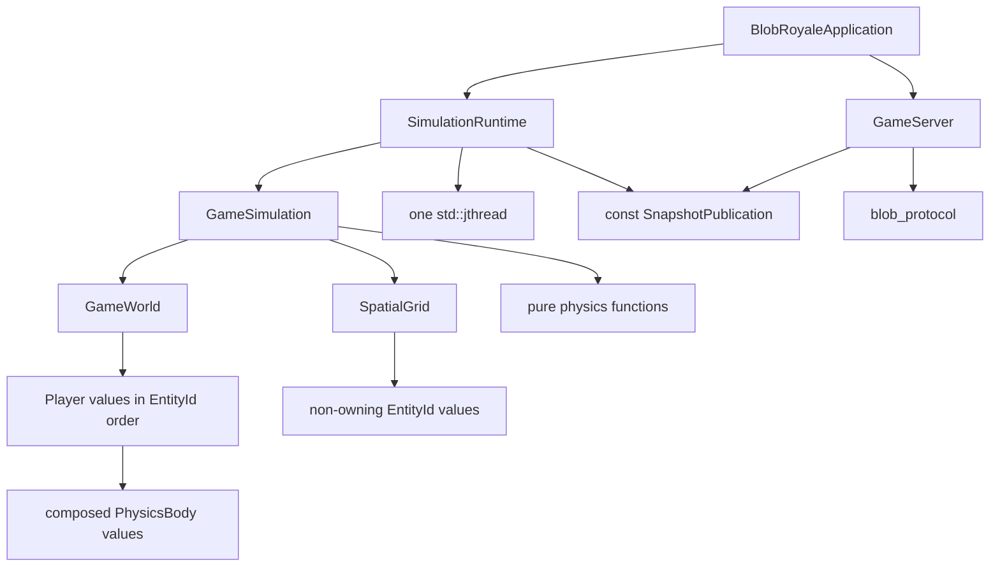

<!-- canonical: simulation_architecture -- ownership and dependency contract -->

# 2. Adopt a deterministic, value-owned simulation architecture

* **Status:** Accepted
* **Date:** 2026-08-04
* **Deciders:** Project owner

## Context

The prototype mixes simulation state, scheduling, locking, serialization, and ambient access. `GameEngine` is a singleton (`src/game_engine/game_engine.cpp:225`), `GamePiece` owns mutexes, collision scratch state, partition links, and JSON concerns (`src/game_engine/game_piece.hpp:45`), partitions and pieces share ownership in both directions (`src/game_engine/game_piece.hpp:66`, `src/game_engine/partition.hpp:55`), and detached recursive workers make lifecycle and ordering implicit (`src/dependency_graph_queue/dependency_graph_queue.tpp:64`, `src/dependency_graph_queue/dependency_graph_queue.tpp:149`). Network handlers reach the singleton directly while workers mutate it (`src/server/helpers.hpp:127`, `src/server/my_websocket.cpp:82`).

The replacement needs one legible owner for every mutable value, one deterministic reference behavior, and object boundaries that express real state and lifecycle rather than class ceremony.

## Decision

Use five one-way build targets:

| Target | Canonical responsibility | May depend on |
|---|---|---|
| `blob_simulation` | Validated simulation values, world ownership, spatial indexing, pure physics, deterministic ticks, immutable snapshot values | C++ standard library only; no Boost, JSON, logging, network, mutexes, condition variables, or threads |
| `blob_runtime` | Clock, lifecycle state machine, one simulation-writer thread, immutable snapshot publication | `blob_simulation`, Threads |
| `blob_protocol` | Versioned JSON envelopes and schema-conformant encoding/decoding | `blob_simulation`, Boost.JSON |
| `blob_server` | TCP/HTTP/WebSocket sessions, routing, limits, and delivery of published snapshots | `blob_runtime`, `blob_protocol`, Boost.Asio/Beast |
| `blob-royale` | Configuration composition, process signals, startup, and ordered shutdown | all four targets |

Dependencies point downward only. A lower target never calls into or includes a higher target.

### Ownership and lifecycle

* `BlobRoyaleApplication` constructs `SimulationRuntime` before `GameServer`, so reverse-order destruction stops network access before destroying the published state or simulation.
* `SimulationRuntime` owns exactly one `GameSimulation`, one persistent `std::jthread`, and one `SnapshotPublication`. Only its runtime thread may mutate the simulation.
* `SnapshotPublication` owns an atomically replaced `shared_ptr<const WorldSnapshot>`. Readers retain immutable snapshots; they never lock or traverse the mutable world.
* `GameSimulation` owns `GameWorld` and `SpatialGrid`. `step(FixedDelta)` is its only mutation entry point and defines the complete tick order.
* `GameWorld` owns `Player` values in stable `EntityId` order. `Player` composes `PhysicsBody`; neither type owns synchronization, serialization, or spatial membership.
* `SpatialGrid` owns cells containing `EntityId` values. It never owns players and players never point back to cells.
* Stateless vector, integration, wall, and collision equations are named pure functions. A class is introduced only when a capability gains independent state or lifecycle.

### OOP policy

Professional OOP here means encapsulated invariants, explicit construction, deterministic destruction, and honest relationships. Composition and value semantics are the default. Concrete constructor injection is preferred while there is one implementation. Inheritance requires a stable, substitutable “is-a” relationship; the current `Player -> GamePiece` hierarchy does not meet that test because `Player` adds only a serialization envelope and a constant answer (`src/game_engine/player.cpp:25`).

The architecture deliberately does not introduce an entity base class, generic repository, service locator, strategy per equation, or interface for every object. These would add names without adding independent capabilities.

## Extension points

* `@extension-point simulation_input`: a future validated input batch may become an argument to `GameSimulation::step`. The baseline has no player-command semantics, so no interface or queue is implemented yet.
* `@extension-point simulation_parallelism`: future bounded parallel work may occur inside tick phases only after native-Linux profiling and equivalence tests prove it useful. `GameSimulation::step` remains the canonical observable contract.
* `@extension-point snapshot_encoding`: new wire encodings may be added within `blob_protocol` without changing domain values or runtime publication. The versioned protocol selects the encoding explicitly.

These are documented seams, not plugin systems. The lightest mechanism is chosen only when a second real implementation exists.

## Considered alternatives

### Repair the dependency-graph scheduler

Rejected. Notification state is copied instead of updated (`src/dependency_graph_queue/cycle_dependency.hpp:101`), external counts are not reset (`src/dependency_graph_queue/cycle_dependency.cpp:237`), predicates span incompatible synchronization domains (`src/dependency_graph_queue/dependency_graph_queue.tpp:141`), and workers recurse and detach. Repair would preserve a general graph around six fixed phases before correctness has a serial oracle.

### Adopt an ECS or actor-per-player model

Rejected. The repository has one meaningful entity type and no demonstrated component-query or actor-isolation requirement. A value-owned world is simpler and does not foreclose a later ECS migration if real gameplay creates that cardinality.

### Create polymorphic physics strategies now

Rejected. There is one collision and integration policy. Pure functions expose the mathematical contract more directly; a strategy hierarchy would model hypothetical variation instead of current behavior.

### Keep singleton access and add locks

Rejected. More locks do not create an ownership model and would keep network, lifecycle, and simulation coupled. Constructor ownership plus immutable publication removes the shared mutable boundary.

## What-if stress tests

* **What if gameplay adds multiple entity kinds?** Add composed value types or a tagged value representation inside `GameWorld`; introduce polymorphism only if substitutable behavior actually appears. The runtime and server remain unchanged.
* **What if 100,000 players require parallel physics?** Profile the serial Linux reference, partition a proven tick phase over disjoint buffers, and compare every resulting snapshot to `GameSimulation::step` semantics. No network or entity ownership changes are required.
* **What if snapshots need binary deltas instead of JSON?** Add a versioned encoder in `blob_protocol`; `WorldSnapshot`, publication, and simulation remain unchanged.
* **What if the simulation runs without a network server?** Construct `SimulationRuntime` alone or call `GameSimulation::step` directly in a batch/test process; neither depends on Beast or Asio.

## Consequences

* Deterministic, single-threaded simulation becomes the correctness oracle and simplest debugging surface.
* Network throughput cannot corrupt or block mutable world state; snapshot copying is an accepted initial cost measured later.
* RAII makes normal shutdown and repeated construction/destruction testable.
* Stable ID ordering and explicit tick phases trade some peak throughput for reproducibility.
* The custom scheduler, singleton, global engine parameters, entity locks, cyclic shared ownership, and domain JSON methods must be deleted during the atomic production cutover.
* Future parallelism or entity polymorphism must earn complexity with a concrete requirement, Linux measurements, and preserved observable behavior.

## Related

* [`0001-linux-runtime-contract.md`](0001-linux-runtime-contract.md) — authoritative build and deployment boundary.
* [`../PROJECT_DEEP_DIVE.md`](../PROJECT_DEEP_DIVE.md) — evidence for current ownership, concurrency, and correctness failures.
* [`../../.claude/plans/2026-08-04-feature-ready-foundation.md`](../../.claude/plans/2026-08-04-feature-ready-foundation.md) — accepted migration and verification sequence.
