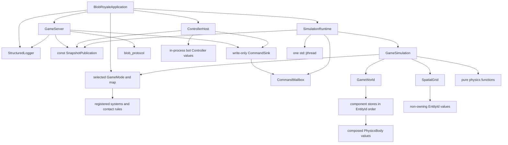

<!-- canonical: simulation_architecture -- ownership and dependency contract -->

# 2. Adopt a deterministic, value-owned simulation architecture

* **Status:** Accepted
* **Date:** 2026-08-04
* **Deciders:** Project owner

## Context

At the reviewed prototype commit, simulation state, scheduling, locking, serialization, and ambient
access were mixed together. The deleted `GameEngine` singleton, entity hierarchy, cyclic partition
ownership, recursive scheduler, and direct network access are documented with exact historical
source evidence in `docs/PROJECT_DEEP_DIVE.md` and remain available in Git history.

The replacement needs one legible owner for every mutable value, one deterministic reference behavior, and object boundaries that express real state and lifecycle rather than class ceremony.

## Decision

Use eight one-way domain libraries plus the production executable:

| Target | Canonical responsibility | May depend on |
|---|---|---|
| `blob_observability` | Bounded atomic JSON-lines events with an injected sink and clock | C++ standard library only |
| `blob_simulation` | Validated simulation values, world ownership, component stores, spatial indexing, pure physics, the fixed tick kernel and its mode hook stages, immutable snapshot values | C++ standard library only; no Boost, JSON, logging, network, mutexes, condition variables, or threads |
| `blob_gameplay` | Concrete game modes, mechanic systems, contact rules, and the static entity kinds their maps place | `blob_simulation` |
| `blob_runtime` | Clock, lifecycle state machine, one simulation-writer thread, the command mailbox and its write-only sink, immutable snapshot publication | `blob_simulation`, Threads |
| `blob_controllers` | The `Controller` interface, in-process bot controllers, and a `ControllerHost` that submits their commands at presentation cadence | `blob_runtime`, `blob_simulation` |
| `blob_protocol` | Versioned JSON envelopes and schema-conformant encoding/decoding | `blob_simulation`, Boost.JSON |
| `blob_server` | TCP/HTTP/WebSocket sessions, routing, limits, delivery of published snapshots, and write-only command submission | `blob_runtime`, `blob_protocol`, `blob_observability`, Boost.Asio/Beast |
| `blob_application` | Strict CLI/INI/CSV input boundaries, application composition, process signals, and ordered shutdown | all seven domain targets |
| `blob-royale` | Minimal process entry point and top-level error translation | `blob_application` |

Dependencies point downward only. A lower target never calls into or includes a higher target.
`blob_application` is a separately linkable library so application tests exercise the identical
production translation units; compiling those sources again inside a test-only target is forbidden.

`blob_gameplay` and `blob_controllers` are the two gameplay extension targets. The abstract
`GameMode`, system, and contact-rule interfaces are `blob_simulation` values, so a concrete mode
depends on the simulation and the simulation never depends on gameplay; `blob_simulation` still
links nothing beyond the standard library. `blob_application` selects the `GameMode`, the map, and
the bot roster and injects them, so no target below it names a concrete mode.

Small internal build targets may expose a cohesive production boundary to more than one consumer
without changing this domain graph. `blob_application_input` owns the canonical CLI/INI/CSV
translation units, `blob_server_configuration` owns validated server configuration, and
`blob_server_http_preflight` owns raw HTTP header inspection. The application, server, tests, and
fuzzers link those targets; none recompiles their `.cpp` files. These are implementation components,
not alternate applications or plugin interfaces.

### Ownership and lifecycle

* `BlobRoyaleApplication` constructs the selected `GameMode` and map, then `SimulationRuntime`, then
  `GameServer` and `ControllerHost`, so reverse-order destruction stops every command source and
  every network reader before destroying the mailbox, the published state, or the simulation.
* `SimulationRuntime` owns exactly one `GameSimulation`, one persistent `std::jthread`, one
  `SnapshotPublication`, and one `CommandMailbox`. Only its runtime thread may mutate the
  simulation, and only that thread drains the mailbox into the tick's `InputBatch`.
* `CommandSink` is the mailbox's write-only capability, not ambient authority: it submits commands
  and does nothing else. It grants no world read, no lifecycle transition, and no reference to
  `GameSimulation` or `SimulationRuntime` (`.claude/plans/2026-09-06-playable-prototype-tailnet.md`
  § "Execution constraints").
* `SnapshotPublication` owns an atomically replaced `shared_ptr<const WorldSnapshot>`. Readers retain immutable snapshots; they never lock or traverse the mutable world.
* `GameSimulation` owns `GameWorld` and `SpatialGrid` and holds the injected `GameMode` for its
  whole life. `step(FixedDelta, const InputBatch&)` is its only mutation entry point and defines the
  complete tick order: the fixed physics kernel plus the mode's systems at named hook stages
  (`0003-deterministic-simulation-contract.md` § "Canonical tick").
* `GameWorld` owns component value stores keyed by `EntityId` and iterated in ascending `EntityId`
  order. An entity is an identifier plus the components it carries; `PhysicsBody` is one such
  component. There is no entity base class and no per-kind entity type.
* Component types are `blob_simulation` values. A mode composes them into entity kinds and
  `WorldSnapshot` publishes them, so `blob_protocol` and `blob_server` carry mode state without ever
  depending on `blob_gameplay`. No component owns synchronization, serialization, or spatial
  membership.
* A `GameMode` is a stateless composition root: it declares its systems, its contact rules, the
  command kinds it accepts, its spawn policy, and the objective predicates a generic match lifecycle
  reads. Registration is fixed at construction and every value its systems mutate is world-owned, so
  a tick's result is a function of the committed world and the tick's `InputBatch` alone.
* Systems share one small interface — a named hook stage, a registration order fixed at mode
  construction, and one call that runs inside `GameSimulation::step`. Nothing outside the tick
  receives a mutable world reference.
* Every command source is a controller: it turns observations — immutable snapshots — into commands
  for the one entity it owns, and its source stamps that `EntityId`, so no controller can command a
  foreign entity. A human player's controller is the network session carrying their decisions, a
  bot's is in-process, and a scripted replay's is a test value. All three reach the world only
  through `CommandSink`, which is why a bot acts exactly as a user does.
* The `Controller` interface in `blob_controllers` is that role's in-process form. A networked
  player's session fills the same role from `blob_server` without depending on `blob_controllers`,
  because the sink, the command kinds, and the ownership stamp are shared and the interface is not.
* `ControllerHost` owns the in-process bot `Controller` values, reads `const SnapshotPublication&`,
  and writes through `CommandSink&`. It never receives `GameSimulation&`, `GameWorld&`, or
  `SimulationRuntime&`, so its cadence and thread choice cannot reach a tick.
* `SpatialGrid` owns cells containing `EntityId` values. It never owns entity state and no component points back to a cell.
* Stateless vector, integration, wall, and collision equations are named pure functions. A class is introduced only when a capability gains independent state or lifecycle.
* `StructuredLogger` is one concrete process-owned dependency injected into application and server
  boundaries. It never enters simulation, runtime, or protocol values and is not an ambient
  singleton.

### OOP policy

Professional OOP here means encapsulated invariants, explicit construction, deterministic
destruction, and honest relationships. Composition and value semantics are the default. Concrete
constructor injection is preferred while there is one implementation. Inheritance requires a
stable, substitutable “is-a” relationship; the deleted prototype's `Player -> GamePiece` hierarchy
did not meet that test because it represented neither independent ownership nor substitutable
behavior.

`GameMode` meets that test and is the one accepted hierarchy here. Every mode genuinely is a
`GameMode`: the simulation calls the same operations on each, a mode is substitutable at composition
without any other target changing, and the accepted framework requires more than one concrete mode
rather than imagining one. The system, contact-rule, and `Controller` interfaces are accepted on the
same evidence; controllers already have three real implementations — a human session whose decisions
arrive over the network, an in-process bot, and a scripted replay used by tests.

The architecture deliberately does not introduce an entity base class, generic repository, service locator, strategy per equation, or interface for every object. These would add names without adding independent capabilities.
That rejection covers speculative hierarchies, not the four interfaces above: entity kinds stay
compositions of component values, physics equations stay pure functions, and an interface still
waits for a second real implementation.

## Extension points

* `@extension-point simulation_input`: realized as the `InputBatch` argument of
  `GameSimulation::step(FixedDelta, const InputBatch&)`. The simulation reads exactly one validated
  batch per tick and never an ambient queue
  (`0003-deterministic-simulation-contract.md` § "Accepted simulation input").
* `@extension-point entity_component`: a new component type is a `blob_simulation` value added to
  the world's stores and iterated in ascending `EntityId` order. Entity kinds gain state by
  composition, never by subclassing.
* `@extension-point simulation_system`: a new mechanic is a new file implementing the system
  interface and registering itself with a mode at a named hook stage. Existing systems do not
  change.
* `@extension-point contact_rule`: a mode registers what a resolved contact means for gameplay. The
  kernel's collision, wall, and integration equations are not dispatched through it.
* `@extension-point game_mode`: a new objective is a new `GameMode` composing systems, contact
  rules, accepted command kinds, a spawn policy, and objective predicates for the generic match
  lifecycle.
* `@extension-point map_definition`: a map is a validated value that seeds bounds, static entity
  kinds, and spawn slots. `blob_application` selects it; a map is data and executes no code.
* `@extension-point command_kind`: a new command is a new member of the `InputBatch` vocabulary, a
  named sub-step in the input phase, a mode that accepts it, and a versioned protocol encoding — not
  an interface, dispatcher, or registry (`0003-deterministic-simulation-contract.md` § "Accepted
  simulation input"). Commands are parsed into batch values at the boundary, so a kind the mode does
  not accept never reaches a tick.
* `@extension-point controller`: a new in-process command source — a bot behavior, later a
  personality or an AI-driven policy, or a scripted replay — is a new `Controller` implementation in
  `blob_controllers`. It observes immutable snapshots, never the world, and submits through
  `CommandSink`.
* `@extension-point simulation_parallelism`: future bounded parallel work may occur inside tick
  phases only after native-Linux profiling and equivalence tests prove it useful.
  `GameSimulation::step` remains the canonical observable contract.
* `@extension-point snapshot_encoding`: new wire encodings may be added within `blob_protocol`
  without changing domain values or runtime publication. The versioned protocol selects the encoding
  explicitly.

Registration is explicit and compile-time: a mode names its systems, contact rules, and accepted
command kinds at its own construction, and `blob_application` names the mode, the map, and the bots
at its own. There is no dynamic discovery, no shared-object loading, no registry global, and no
service locator. `simulation_parallelism` and `snapshot_encoding` remain documented seams with no
second implementation; the lightest mechanism is still chosen only when a second real implementation
exists.

## Considered alternatives

### Repair the dependency-graph scheduler

Rejected. The historical implementation copied notification state instead of updating it, failed to
reset external counts, evaluated predicates across incompatible synchronization domains, and used
recursive detached workers. The exact evidence is retained in `docs/PROJECT_DEEP_DIVE.md`. Repair
would preserve a general graph around six fixed phases before correctness has a serial oracle.

### Adopt an ECS or actor-per-player model

Component composition adopted; the framework and the actor model still rejected. The 2026-09-06
gameplay requirement supplies the entity cardinality this record reserved, so the world now stores
composable component values keyed by `EntityId` — the migration the original decision kept open.
What stays rejected is a general ECS *framework*: archetype storage, dynamic queries, and a
scheduler that infers system order from declared component access. Component stores are plain value
stores iterated in ascending `EntityId`, and system order is the mode's declared registration order
inside a fixed stage list. Actor-per-player stays rejected outright, because per-entity concurrency
would replace the single deterministic writer and make the recorded command log unreplayable.

### Create polymorphic physics strategies now

Rejected, and the framework does not change it. There is one collision and integration policy. Pure functions expose the mathematical contract more directly; a strategy hierarchy would model hypothetical variation instead of current behavior.
`@extension-point contact_rule` dispatches what a contact *means* to gameplay, never how a contact
is *resolved*: the impulse, wall, and integration equations keep their single pure-function
implementation.

### Keep singleton access and add locks

Rejected. More locks do not create an ownership model and would keep network, lifecycle, and simulation coupled. Constructor ownership plus immutable publication removes the shared mutable boundary.

## What-if stress tests

* **What if gameplay adds multiple entity kinds?** Adopted on 2026-09-06 rather than hypothetical.
  `GameWorld` owns composable component value stores keyed by `EntityId`, and an entity kind —
  player, wall, obstacle, pickup, projectile — is a composition a mode declares, not a class. No
  entity hierarchy appears; substitutable behavior is expressed by systems and contact rules, and
  the runtime, protocol, and server remain unchanged.
* **What if 100,000 players require parallel physics?** Profile the serial Linux reference, partition a proven tick phase over disjoint buffers, and compare every resulting snapshot to `GameSimulation::step` semantics. No network or entity ownership changes are required.
* **What if snapshots need binary deltas instead of JSON?** Add a versioned encoder in `blob_protocol`; `WorldSnapshot`, publication, and simulation remain unchanged.
* **What if the simulation runs without a network server?** Construct `SimulationRuntime` alone or call `GameSimulation::step` directly in a batch/test process; neither depends on Beast or Asio.

## Consequences

* Deterministic, single-threaded simulation becomes the correctness oracle and simplest debugging surface.
* Network throughput cannot corrupt or block mutable world state; snapshot copying is an accepted initial cost measured later.
* RAII makes normal shutdown and repeated construction/destruction testable.
* Stable ID ordering and explicit tick phases trade some peak throughput for reproducibility.
* The atomic production cutover deleted the custom scheduler, singleton, global engine parameters, entity locks, cyclic shared ownership, and domain JSON methods; Git history remains the archive.
* Future parallelism or entity polymorphism must earn complexity with a concrete requirement, Linux measurements, and preserved observable behavior.
* Entity composition, the mode interface, and the two gameplay targets are earned by the stated
  2026-09-06 requirement — multiple modes and maps, many entity kinds, mechanics added by creating a
  file and registering it, and computer-controlled entities that act exactly as users do. The rule
  above is satisfied, not waived.
* The fixed physics kernel stays the correctness oracle. No mode reorders, replaces, or skips a
  kernel phase, so every accepted fixture horizon measures the same mechanism under every mode
  (`0003-deterministic-simulation-contract.md` § "Canonical tick").
* Registration points are the only places a core file changes as the game grows. A new mechanic,
  entity kind, contact rule, mode, map, command kind, or controller is a new file plus one
  registration, not an edit to the tick, the runtime, or the server.
* Systems inherit the tick's determinism obligations: iterate in ascending `EntityId`, read no wall
  clock and no ambient input, and draw randomness only from the world-owned seeded stream the tick
  commits. A system that cannot meet them does not belong inside `step`.
* Controllers inherit the opposite freedom. They run outside the tick, so a bot may be
  non-deterministic, asynchronous, or AI-driven without touching replayability: replaying the
  recorded command log reproduces a match exactly, while replaying the controllers that produced it
  does not.
* Two more targets and one interface layer cost build-graph edges and one indirection per stage. The
  mode boundary is the only inheritance in the system and the kernel keeps its concrete types.

## Related

* [`0001-linux-runtime-contract.md`](0001-linux-runtime-contract.md) — authoritative build and deployment boundary.
* [`0003-deterministic-simulation-contract.md`](0003-deterministic-simulation-contract.md) — canonical tick: the fixed kernel phases and the gameplay stages a mode's systems occupy.
* [`0004-gameplay-architecture.md`](0004-gameplay-architecture.md) — component model, hook stages, `GameMode` composition root, and controller contract in detail.
* [`0005-royale-mode.md`](0005-royale-mode.md) — the accepted core loop, which becomes the first concrete `GameMode`.
* [`../PROJECT_DEEP_DIVE.md`](../PROJECT_DEEP_DIVE.md) — historical evidence that motivated the replacement.
* [`../../src/simulation/README.md`](../../src/simulation/README.md) — current deterministic domain contract.
* [`../../src/runtime/README.md`](../../src/runtime/README.md) — current single-writer lifecycle and publication contract.
* [`../../src/observability/README.md`](../../src/observability/README.md) — current structured event boundary.
* [`../../.claude/plans/2026-08-04-feature-ready-foundation.md`](../../.claude/plans/2026-08-04-feature-ready-foundation.md) — accepted migration and verification sequence.
* [`../../.claude/plans/2026-09-06-playable-prototype-tailnet.md`](../../.claude/plans/2026-09-06-playable-prototype-tailnet.md) — accepted plan; its execution constraints fix the single-writer and write-only command-sink boundary.

**Amended 2026-09-06:** The project owner requires an extensible game framework — multiple game
modes with their own objectives and maps, many entity kinds, mechanics added by creating a file and
registering it, and computer-controlled entities that act exactly as users do. That is the gameplay
cardinality this ADR reserved, so what it deferred is now accepted. Entities become identifiers
carrying composable component values in ascending `EntityId` order, replacing the single `Player`
type and still introducing no entity hierarchy. The tick becomes a fixed physics kernel plus named
hook stages where a mode registers its own deterministic systems. `GameMode` becomes the abstract
composition root for gameplay and the one accepted inheritance, because every mode genuinely is a
`GameMode`; speculative hierarchies stay rejected. Two targets extend the one-way graph:
`blob_gameplay` over `blob_simulation`, and `blob_controllers` over `blob_runtime` and
`blob_simulation`. `blob_runtime` gains a `CommandMailbox` that only its worker drains and exposes
`CommandSink` as a write-only capability that `blob_server` and `ControllerHost` hold beside
`const SnapshotPublication&`. Every invariant that made the foundation trustworthy is unchanged:
one deterministic writer, `GameSimulation::step` as the only mutation entry point, value semantics,
ascending `EntityId` ordering, a `blob_simulation` that links nothing beyond the standard library,
immutable snapshots, and a server that never receives `GameSimulation&` or `SimulationRuntime&`.
[`0004-gameplay-architecture.md`](0004-gameplay-architecture.md) specifies the component model, the
stage list, the mode contract, and the controller contract; this amendment admits them into the
ownership and dependency contract only, and the decision and its `Accepted` status are unchanged.
